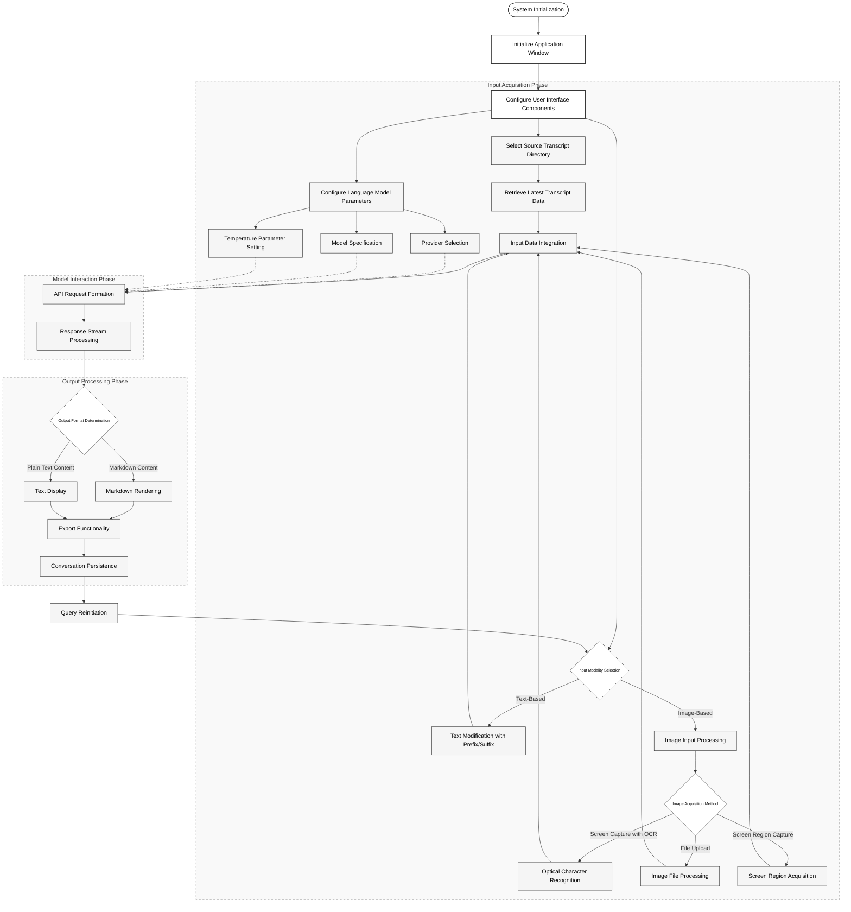

# Transcript-companion
[中文版README](README_zh.md)

- [Features](#features)
- [Requirements](#requirements)
- [Setup](#setup)
- [Usage](#usage)
- [Interface Preview](#interface-preview)
  - [Light Theme](#light-theme)
  - [Dark Theme](#dark-theme)

**A GUI application built with Python/PyQt6 that processes speech transcripts using LLM APIs. This tool simplifies the workflow of analyzing and summarizing meeting recordings by leveraging the power of large language models.**

## Features

* **Modern UI with Sidebar:** A clean, modern interface with a convenient sidebar for quick access to common functions:
    * Language Toggle (🀄/🔤)
    * Theme Toggle (🌙/☀️)
    * Help (❓)
    * Settings (⚙️)
    * Quick Clear (🗑️)
    * Refresh Models (🔄)
* **Folder Selection:** Choose the directory containing your speech transcription files (e.g., `.txt`, `.md`).
* **Multi-LLM Support:** Seamlessly integrate with various LLM providers:
    * **Cerebras** (llama3.1-70b, llama3.1-8b) :sparkles: **FASTEST:** Best choice for quick response times
    * **Groq** (mixtral-8x7b-32768, llama-3.1/3.3 models) 
    * **Google Gemini** (gemini-1.5-flash models) :books: **LARGEST CONTEXT:** Ideal for long transcripts
    * **Sambanova** (llama-3.1 models, including llama3.1-405B, Qwen2.5 models)
    * **Zhipu** (glm-4-flash)
    * **GLHF** (Llama-3.3-70B)
    * **SiliconFlow** (Qwen2.5-7b)
    * **LOCAL** (LMstudio/Kobold/Ollama) :computer: **PRIVATE:** Best choice for data security
* **Temperature Control:** Adjust the temperature parameter (0.0-1.5) to fine-tune the creativity and randomness of the LLM's responses. Lower values result in more focused and deterministic outputs, while higher values encourage more diverse and unexpected generation.
* **Customizable Prefix/Suffix:** Add custom prefix and suffix text to your transcripts before sending them to the LLM. This allows you to provide additional context or instructions to the model, shaping its output to better suit your needs.
* **Image Integration:** Enhance your prompts with visual content:
    * **Screenshot with OCR:** Capture a region of your screen and automatically extract text from it
    * **Image Upload:** Add images from your local files
    * **Direct Screenshot:** Capture a region of your screen without OCR processing
    * **Image Preview:** View the currently selected image within the application
    * **Vision Models Support:** Use compatible models to analyze both text and images together
* **Real-time Streaming:** View LLM responses in real-time as they are generated, providing immediate feedback and a dynamic interaction with the model.
* **Clipboard Integration:** Easily copy the processed transcript content to the clipboard for use in other applications.
* **Bilingual Support (Chinese/English):** The GUI now supports both Chinese and English. You can switch between languages within the application.
* **Dark Mode:** Toggle between light and dark themes for comfortable viewing in different lighting conditions. Use the moon/sun icon in the sidebar to switch themes.
* **Conversation Export:** Export conversations including prompts and responses to timestamped text files in the history folder for future reference.

## Core workflow


## Requirements

* **Python 3.x**
* **PyQt6**
* The following Python packages:
    * ``PyQt6``
    * ``openai``
    * ``pyperclip``
    * ``requests``
    * ``Pillow``
    * ``textract``

You can install these packages using pip:

```bash
pip install -r requirements.txt
```

## Setup

1. **Clone the Repository:**

   ```bash
   git clone https://github.com/Franklyc/Transcript-companion.git
   ```

2. **Configuration:**

   * **Rename Example Files:** Copy and rename the following files:
      * `config.py.example` to `config.py`
      * `prefix.py.example` to `prefix.py`
   * **API Keys:** Open the newly created `config.py` and replace the placeholder API keys with your actual keys for each LLM provider. These keys are typically obtained from the respective provider's website.
   * **Default Folder:** You can also modify the `DEFAULT_FOLDER_PATH` in `config.py` to point to the directory where your transcripts are stored.
   * **Customize Prefix:** Edit `prefix.py` to modify the `get_original_prefix()` function. This allows you to define the initial instructions or context provided to the LLM before processing each transcript. Provide clear and concise instructions to guide the LLM's response.


3. **Run the Application:**

   ```bash
   python main.py
   ```

## Usage

1. **Understand the Interface:**
    * Use the sidebar buttons for quick access to common functions
    * Language toggle (🀄/🔤) switches between Chinese and English
    * Theme toggle (🌙/☀️) switches between light and dark modes
    * Help button (❓) shows usage instructions
    * Settings button (⚙️) for additional options
    * Clear button (🗑️) quickly clears all input/output fields
    * Refresh button (🔄) updates the list of available local models
2. **Select Folder:** Click "Select Folder" and navigate to the directory containing your transcript files.
3. **Choose Model:** Select your desired LLM model from the dropdown menu.
4. **Set Temperature:** Adjust the temperature value as needed.
5. **Add Custom Text:** Enter any custom prefix or suffix text in the provided text boxes.
6. **Add Images or Screenshots:**
    * Click "Screenshot and OCR" to capture a screen region and extract text from it
    * Click "Upload Image" to select an image from your computer
    * Click "Capture Screenshot" to take a screenshot without OCR
    * Use the image preview area to see your currently selected image
    * Click "Clear Image" to remove the current image
7. **Process Transcript:** Click "Copy and Get Answer" to send the latest transcript to the selected LLM. The response will be displayed in the output text box.
8. **Export Conversation:** Click the "Export Conversation" button to save both the prompt and response to a timestamped file in the history folder.

## Interface Preview

### Light Theme


### Dark Theme


