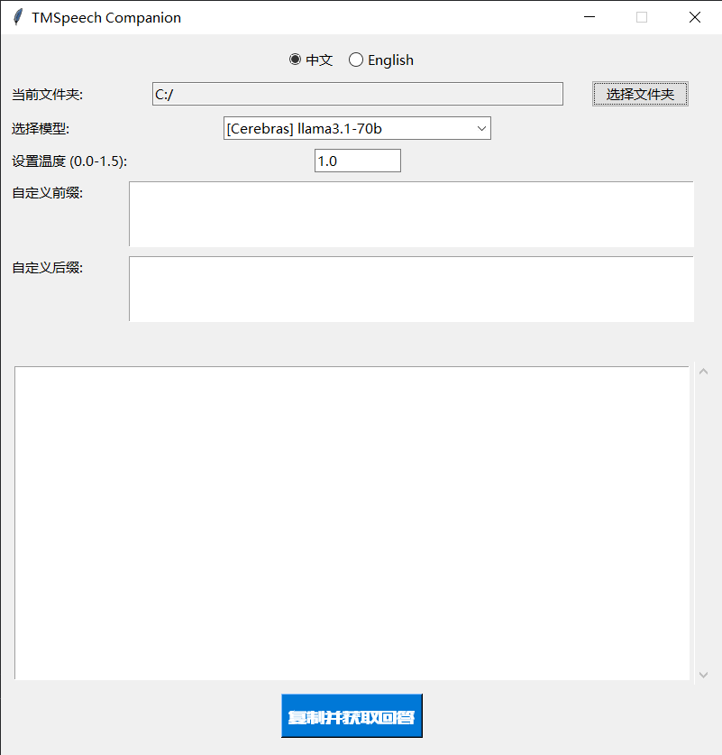

# TMSpeech-companion

一款使用 Python/Tkinter 构建的 GUI 应用程序，它使用 LLM API 处理语音转录本。此工具利用大型语言模型的强大功能，简化了分析和总结会议记录的工作流程。

> **重要提示：**此配套工具专为与 [TMSpeech](https://github.com/jxlpzqc/TMSpeech) v0.0.1-rc3 配合使用而创建。由于 TMSpeech v0.4.0 及更高版本中转录历史记录存储方式的更改，此工具目前与较新版本不兼容。

## 功能

- **文件夹选择：**选择包含语音转录文件的目录（例如，.txt、.md）。
- **多 LLM 支持：**与各种 LLM 提供商无缝集成：
    - Cerebras (llama3.1-70b, llama3.1-8b)
      ✨ **最快：**快速响应时间的最佳选择
    - Groq (mixtral-8x7b-32768, llama-3.1 等模型)
    - Google Gemini (gemini-1.5-flash 等模型)
      📚 **最大上下文：**长转录的理想选择
    - Sambanova (llama-3.1 等模型，包括 llama3.1-405B)
- **温度控制：**调整温度参数 (0.0-1.5) 以微调 LLM 响应的创造性和随机性。较低的值会导致更集中和确定的输出，而较高的值会鼓励更多样化和意想不到的生成。
- **可自定义的前缀/后缀：**在将转录发送到 LLM 之前，向其添加自定义前缀和后缀文本。这允许您向模型提供额外的上下文或说明，从而调整其输出以更好地满足您的需求。
- **实时流式传输：**在生成 LLM 响应时实时查看它们，提供即时反馈以及与模型的动态交互。
- **剪贴板集成：**轻松将处理后的转录内容复制到剪贴板以在其他应用程序中使用。
- **双语支持（中文/英文）：**GUI 现在支持中文和英文。您可以在应用程序内切换语言。

## 要求

- Python 3.x
- 以下 Python 包：
    - `tkinter`（通常包含在 Python 中）
    - `openai`
    - `pyperclip`

您可以使用 pip 安装这些包：
```bash
pip install openai pyperclip
```

## 设置

1. **克隆存储库：**
   ```bash
   git clone https://github.com/Franklyc/TMSpeech-companion.git
   ```
2. **配置：**
   - **重命名示例文件：**复制并重命名以下文件：
     - `config.py.example` 为 `config.py`
     - `prefix.py.example` 为 `prefix.py`
   - **API 密钥：**打开新创建的 `config.py` 并将占位符 API 密钥替换为您每个 LLM 提供商的实际密钥。这些密钥通常从相应提供商的网站获取。
   - **默认文件夹：**您还可以修改 `config.py` 中的 `DEFAULT_FOLDER_PATH` 以指向存储转录的目录。
   - **自定义前缀：**编辑 `prefix.py` 以修改 `get_original_prefix()` 函数。这允许您定义在处理每个转录之前提供给 LLM 的初始说明或上下文。提供清晰简洁的说明以指导 LLM 的响应。
3. **运行应用程序：**
   ```bash
   python main.py
   ```

## 使用方法

1. **选择文件夹：**单击“选择文件夹”并导航到包含转录文件的目录。
2. **选择模型：**从下拉菜单中选择所需的 LLM 模型。
3. **设置温度：**根据需要调整温度值。
4. **添加自定义文本：**在提供的文本框中输入任何自定义前缀或后缀文本。
5. **处理转录：**单击“复制并获取回答”以将最新的转录发送到所选的 LLM。响应将显示在输出文本框中。


